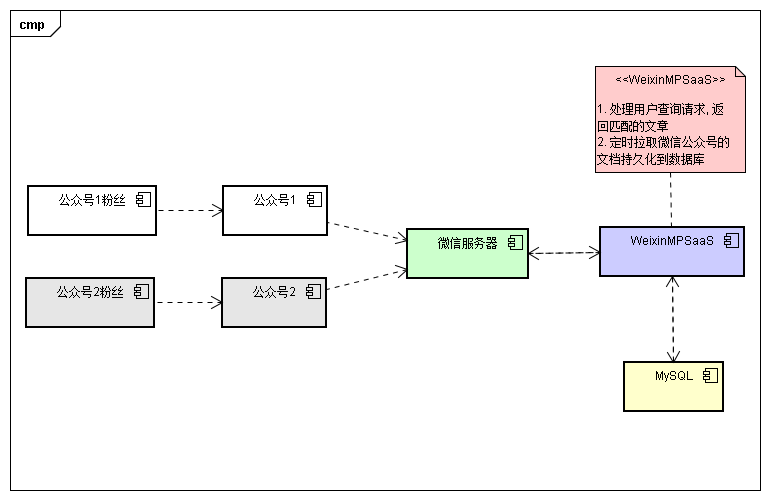
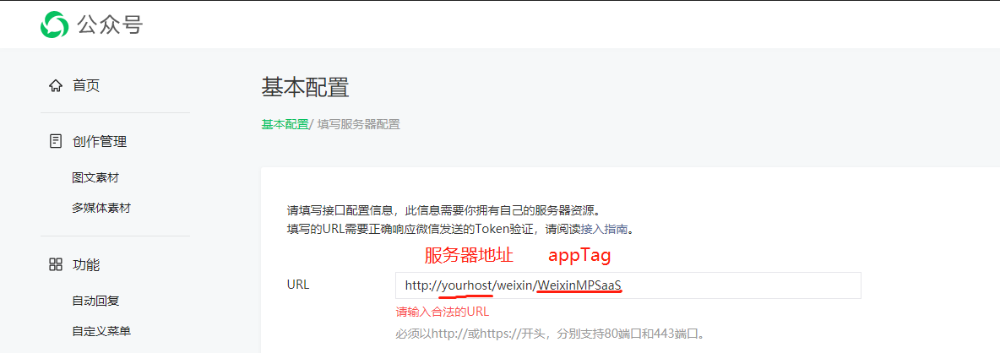
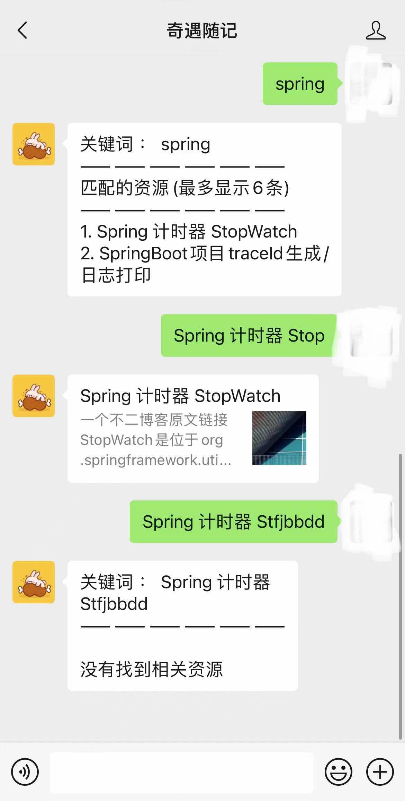

# WeixinMPSaaS

#### 介绍
微信公众号后台服务SaaS, 支持微信公众平台(订阅号、服务号、企业号、小程序). 

* 支持多个微信公众号配置
* 动态更新配置

本项目仍在不断迭代开发中,遇到问题请提 issues , 谢谢配合. 

> [微信公众号开发官方文档](https://developers.weixin.qq.com/doc/)

> [微信公众号开发SDK](https://github.com/Wechat-Group/WxJava)


#### 软件架构

本项目基于 Spring Boot 构建, 对接微信公众号Api.



#### 安装教程

* 创建MySQL数据库
```mysql
CREATE SCHEMA `weixin_mp_saas` DEFAULT CHARACTER SET utf8mb4 ;
```

* 生成可执行jar包

```shell
mvn clean package -Dmaven.test.skip=true
```

* 启动服务

```shell
java -jar any-share.jar
```
* 配置项
    * server.port 服务端口号, 默认是 8080
    * mysql.host 默认是 127.0.0.1:3306
    * mysql.username 默认是 root
    * mysql.password 默认是 toor
    * mysql.database.name 数据库名称 weixin_mp_saas

```shell
java -jar -Dserver.port=8080 -Dmysql.host=localhost:3306 -Dmysql.username=root -Dmysql.password=toor -Dmysql.database.name=weixin_mp_saas weixin-mp-saas.jar
```

#### 使用说明

1.  调用Http接口新增微信公众号配置
    * 开发者密码(AppSecret) : "secret"
    * 消息加解密密钥 : "aesKey"
    * 开发者ID(AppID) : "appid"
    * 令牌(Token) : "token"
    * 应用标识 : "appTag"

appTag与微信无关, 是本项目用于标识应用的, 因为本项目可支持多个微信公众号. 
所以 appTag 就是用来区别不同公众号的一个配置项.
假设 appTag 设置为 "WeixinMPSaaS", 那么在公众号基本配置页面配置如下 : 
    

    
    
```shell script
curl --location --request POST 'http://127.0.0.1:8080/config/weixin/openapi/add' \
--header 'Content-Type: application/json' \
--data-raw '{
    "appTag":"xx",
    "secret":"xx",
    "aesKey":"xx",
    "appid":"xx",
    "token":"xx",
    "verifyValue":"xx",
    "verifyKey":"xx"
}'
```

#### 效果演示



